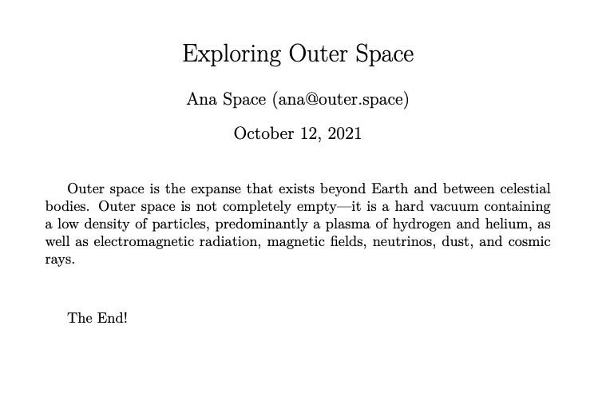

# JTEX

JTEX is a command line tool (CLI) for rendering LaTeX documents from jinja-style templates. This package uses [Jinja2](https://pypi.org/project/Jinja2/) as the template engine with a modified environment and syntax that plays well with LaTeX's markup.

This allows you to build LaTeX documents driven by content, data and a template. We built this package while developing our template based PDF/LaTeX export system for [Curvenote](https://curvenote.com), where it is used to create documents from the templates on the [Curvenote Community Template Repo](https://github.com/curvenote/templates).

## Installation

Install the package into your virtual environment using pip:

```
  pip install jtex
```

and confirm correct installation by typing:

```
  jtex --version
```

## An example

As we are dealing with content and data, the cli accepts _paths_ to specific files or folders rather than accepting arguments inline. Here is a minimal example:

Given these 3 files:

```
# data.yml
title: Exploring Outer Space
author:
  name: Ana Space
  email: ana@outer.space
```

```
% content.tex
Outer space is the expanse that exists beyond Earth and between celestial bodies. Outer space is not completely empty—it is a hard vacuum containing a low density of particles, predominantly a plasma of hydrogen and helium, as well as electromagnetic radiation, magnetic fields, neutrinos, dust, and cosmic rays.
```

```
% template.tex
\documentclass{article}

\title{[-title-]}
\author{[-author.name-] ([-author.email-])}

\begin{document}
\maketitle

[-CONTENT-]
\vskip 1cm
The End!
\end{document}
```

We can render a LaTeX document with the following command:

```
  jtex build-lite output.tex data.yml content.tex template.tex
```

To produce a `.tex` file with the following contents:

```
% output.tex
\documentclass{article}

\title{Exploring Outer Space}
\author{Ana Space (ana@outer.space)}

\begin{document}
\maketitle

% content.tex
Outer space is the expanse that exists beyond Earth and between celestial bodies. Outer space is not completely empty—it is a hard vacuum containing a low density of particles, predominantly a plasma of hydrogen and helium, as well as electromagnetic radiation, magnetic fields, neutrinos, dust, and cosmic rays.
\vskip 1cm
The End!
\end{document}
```

Which when compiled produces the following document:



The document layout is flexible and will be based on structure provided in the `template.tex` file, where the modified jinja syntax (`[-`, `-]`) is used to expand variables from the matching DocModel provided in `data.yml`.

`[-CONTENT-]` is a special variable that will expand to the entire contents of `content.tex`

This example only shows variable expansion (`[-myvar-]`) but the full `jinja2` environment is available with control flow, filters and many python commands.

The `build-lite` command shown above is not opinionated and can be used to render any template with a matching DocModel data structure.

## CLI Overview

Get help from the command line tool at any time using the `--help` option.

```
  jtex --help
```

> Note: the CLI uses `typer` which provides shell completion option as standard. These are list in help messages and installation is recommended, but these commands are not central to use of the tool.

### Command overview

The following commands are available on the cli.

#### build-lite

`build-lite` is an un-opinionated rendering command which as in the example above will allow you to render any template given content and a DocModel.

```
jtex build-lite --help

Usage: jtex build-lite [OPTIONS] DATA_YML TEMPLATE_TEX OUTPUT_TEX

Arguments:
  DATA_YML       Path to a YAML file containing the DocModel (a free-form
                 dict) required to render the template.  [required]
  TEMPLATE_TEX   Path to a file with a compatible LaTeX template e.g.
                 mytemplate.tex. The template should align with the data
                 structure given by the DocModel  [required]
  OUTPUT_TEX     Name of a local file to write the rendered content to. If
                 OUTPUT exists it will be replaced.  [required]

Options:
  --content FILE          Path to a file containing the content to render in
                          the [-CONTENT-] variable  [required]
  --bib FILE              Path to an optional bib file. This will be copied as-
                          is into the target folder.
  --lipsum / --no-lipsum  If specified will patch the document with
                          '\usepackage{lipsum}'. Useful in testing where
                          `content.tex` or `temaplte.tex` uses the lipsum
                          package.  [default: no-lipsum]
  --help                  Show this message and exit.
```

The "DocModel" in this case is a bit of an overstatement as it is just a free-form python dictionary defined in the `data.yml` file as shown above.

As you build your template, you can decide on the structure of the data in this file and keep it aligned with the variables you access from within the template. To find out more see [Creating Templates](#creating-templates)

#### build

`build` is an opinionated rendering command intended for use with Curvenote content and templates specifically.

```
jtex build --help

Usage: jtex build [OPTIONS] CONTENT_PATH OUTPUT_PATH

Arguments:
  CONTENT_PATH  Path to a folder with containing data and content to render.
                The folder should contain the following files: data.yml,
                main.tex, main.bib - along with any additional graphics assets
                [required]
  OUTPUT_PATH   Path to a folder in which to construct the Latex assets. If
                OUTPUT_PATH exists it and all files will be removed and a new
                empty folder created  [required]

Options:
  --template-path DIRECTORY  Path to a Curvenote compatible LaTeX template
                             folder. This is intended for use with local
                             Curvenote templates or in template
                             development. Omitting this option will use the
                             built in template.
  --template-name TEXT       Name of a Curvenote template available from the
                             public Curvenote API. (e.g. 'default').
                             Specifying template-path will override this
                             option if both are provided.
  --lipsum / --no-lipsum     If lipsum, will patch the document with
                             '\usepackage{lipsum}'. Useful when testing
                             templates, where `content.tex` uses the lipsum
                             package.  [default: no-lipsum]
  --strict / --no-strict     If strict, then missing required tagged content
                             or options will halt the process.  [default: no-
                             strict]
  --copy / --no-copy         Should image assets will be copied into the
                             target folder?  [default: copy]
  --help                     Show this message and exit.
```

When exporting LaTeX from Curvenote's API custom environments and commands are included by default. These require certain packages to be loaded and definitions to be included in the final document. `build` will include these definition files and expect certain structure to be present in the `DocModel` when rendering.

As `build` is not generally applicable outside of Curvenote templates, we'll not discuss the details further here. For more information check the [Curvenote Open Template Repo](https://github.com/curvenote/templates).

> Note: The Curvenote API can also respond with vanilla LaTeX, but this is not the default case for rendering. For more information on programmatically accessing the Curvenote API, [see the Curvenote python client](https://pypi.org/project/curvenote/).

#### validate

`validate` is a dry run command which will validate a Curvenote template. This is very simple validation at the moment and we expect this to be extended.

```
jtex validate --help

Usage: jtex validate [OPTIONS] TEMPLATE_PATH

Arguments:
  TEMPLATE_PATH  Local folder containing the Curvenote compatible template to
                 validate  [required]
```

## Creating Templates

This cli tool uses a customized `jinja2` environment. We explain the custom syntax below and how to use that in conjunction with the `content.tex` and `data.yml` files in a bit more detail than shown in the [previous example](#an-example).

However, to get the most out of this tool, understanding how `jinja2` works and the features it provides will help a lot. The [Jinja Template Designer Documentation](https://jinja.palletsprojects.com/en/3.0.x/templates/) is a great resource, covering all the features of the `jinja2` language in the context of HTML rendering and the standard `jinja2` syntax.

That guide along with the information included below for LaTeX rendering and our custom syntax should give you everything you need to know to produce your own templates.

### Jinja

About `jinja` templates:

> A template contains variables and/or expressions, which get replaced with values when a template is rendered; and tags, which control the logic of the template. The template syntax is heavily inspired by Django and Python.

The cli uses a `jinja2` environment with the following modifications.

#### Syntax

|             | customized | standard jinja2 |
| ----------- | ---------- | --------------- |
| Statements  | `[# #]`    | ``         |
| Expressions | `[- -]`    | `{{ }}`         |
| Comments    | `%# #%`    | `{# #}`         |

A minimal LaTeX example illustrating these would be:

```
\documentclass{article}
\begin{document}
\section{Famous People}
%# Print a list of famous people defined in the context dictionary #%
\begin{itemize}
[# for person in famous_people #]
\item [-person.name-], [-person.job-] [# if person.email #]([-person.email-])[# endif #]
[# endfor #]
\end{itemize}
\end{document}
```

Which will print out a list of famous people's names, jobs and emails, if we have them.

#### Other environment differences

In addition to the custom syntax we also set the following options:

| option                | our setting     | jinja default | effect                                                                                              |
| --------------------- | --------------- | ------------- | --------------------------------------------------------------------------------------------------- |
| trim_blocks           | True            | False         | If this is set to True the first newline after a block is removed (block, not variable tag!)        |
| autoescape            | False           | True          | If set to False the XML/HTML autoescaping feature is disabled                                       |
| auto_reload           | True            | False         | Will always check template location for changes and recompiles the template as needed               |
| undefined             | SlientUndefined | None          | Ignore any undefined variables in the template, render anyways without affected blocks or variables |
| keep_trailing_newline | True            | False         | Preserve the trailing newline when rendering templates, important in LaTeX                          |

`jinja` provide a whole host of [functions](https://jinja.palletsprojects.com/en/3.0.x/templates/#list-of-global-functions), [tests](https://jinja.palletsprojects.com/en/3.0.x/templates/#list-of-builtin-tests) and [filters](https://jinja.palletsprojects.com/en/3.0.x/templates/#list-of-builtin-filters) at global scope. We have extended further this by adding the python `__builtins__` providing additional [commonly used python functions](https://docs.python.org/3/library/functions.html#built-in-funcs) within the `jinja` rendering context.

### Building a DocModel

We use the term DocModel in our documentation to refer to the dictionary of data passed to a `jinja` template for rendering, loaded from a `data.yml` file. `jinja` docs call this the _Context Dictionary_. It is easy to relate this to the `yml` file that you need to create to use the cli.

The fields at the root level of the file are available as variables in the `jinja` context at global scope.

```
# data.yml
title: Outer Space
author: Ana Cosmo

% template.tex
...
\title{[-title-]}
\author{[-author-]}
...
```

You can add comments to your template, and these will be removed at render time. Just in case, the comments are also valid LaTeX comments so should not affect your build even if one did leak through

```
  % template.tex

  % this is a LaTeX comment
  %# this is a template comment and will be removed at render, but it is also a valid LaTeX comment #%
```

These variables themselves can be nested data structures of dictionaries, lists, strings, numbers and booleans

```
# data.yml
authors:
  - name: Ana Cosmo
    email: ana@thecosmos.org
  - name: Bill Saturn
    email: bill@gasgiant.com
tags:
  - space
  - planets
  - cosmos

% template.tex
...
[# for author in authors #]
\author{[-author.name-] ([-author.email-])}
[# endfor #]

The first author is [-authors[0].name-]
The last author is [-authors[-1].name-]

tags: [-tags|join(', ')-]

%# main content goes here #%
[-CONTENT-]
...
```

`[-CONTENT-]` is a special variable that will expand to the entire contents of `content.tex`

We'll not go into more `jinja` features here, as they are covered in the [Jinja Template Designer Documentation](https://jinja.palletsprojects.com/en/3.0.x/templates/) -- simply replace the standard `jinja` syntax with our customized `syntax` and bear in mind the rules of LaTeX and constructing sophisticated templates is pretty straightforward with practice.

### Curvenote Templates

To look at some of the templates we've developed at Curvenote, or for documentation on how to create template for Curvenote please visit the [Open Template Repo](https://github.com/curvenote/templates) and check the documentation there.

We use this cli tool for development, testing and validation of any template submitted to that repo.
